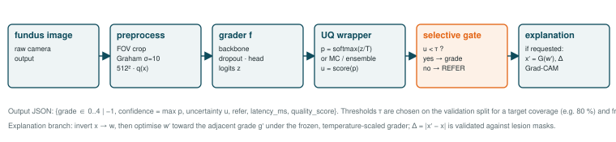
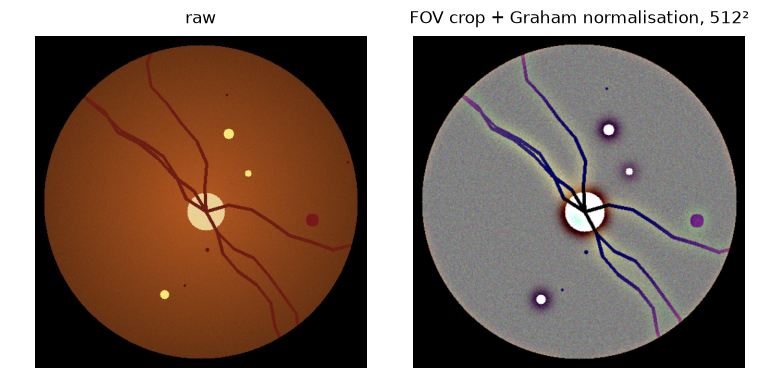
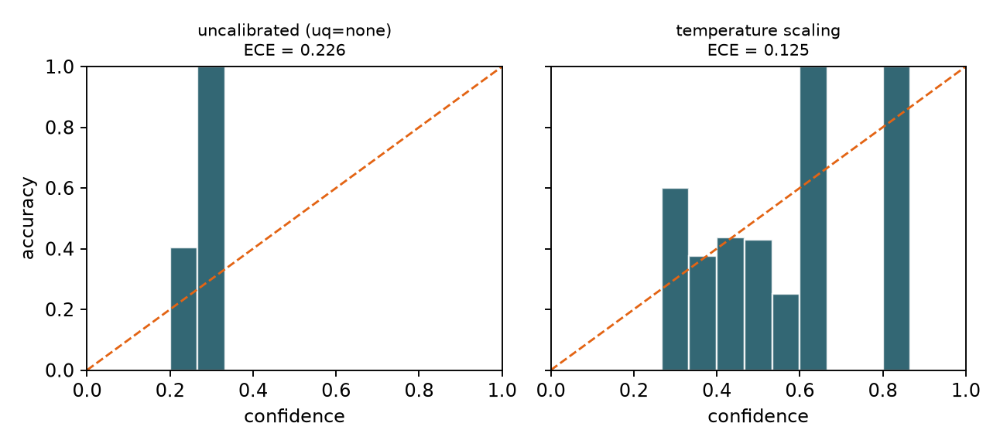
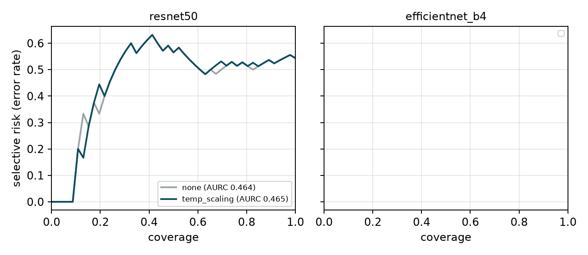
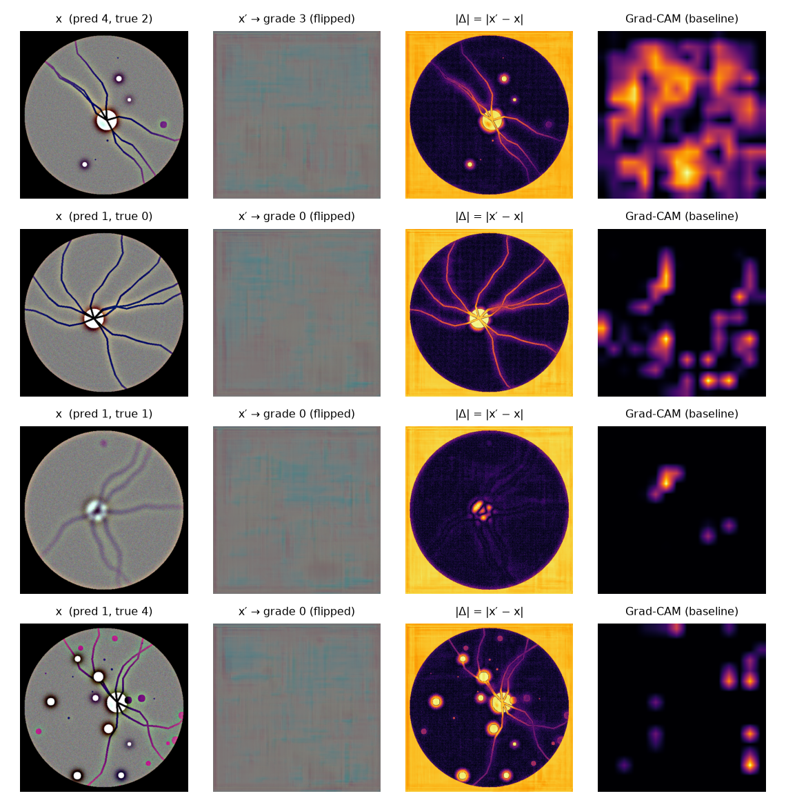
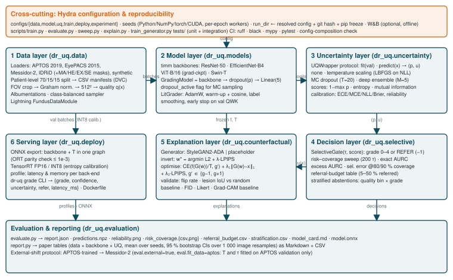
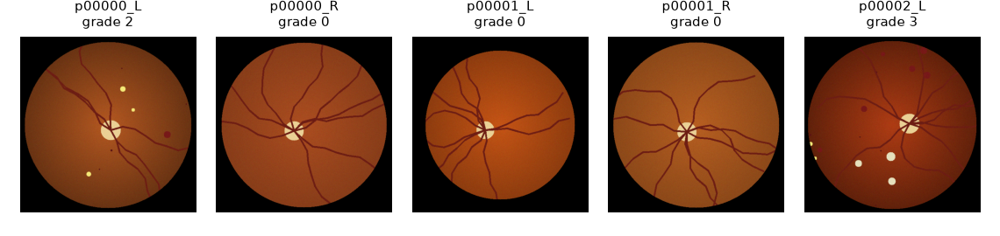

<div align="center">

# 👁️ dr_uq

### Uncertainty-Calibrated Diabetic Retinopathy Grading<br>with Counterfactual Visual Explanations

*An eye-screening AI that knows when to say **"I'm not sure, ask a human"** — and explains its grade the way a clinician thinks.*

[](pyproject.toml)
[](https://pytorch.org)
[](https://lightning.ai)
[](https://hydra.cc)
[](tests/)
[](pyproject.toml)
[](pyproject.toml)

</div>

> **Research prototype — not a medical device.** Built and evaluated only on public, de-identified fundus corpora.
> It has not been clinically validated and must not be used to diagnose, screen or manage patients.

---

## Table of contents

1. [Why this project](#-why-this-project)
2. [How it works, in pictures](#-how-it-works-in-pictures)
3. [System architecture](#-system-architecture)
4. [Preliminary results](#-preliminary-results)
5. [Quick start](#-quick-start)
6. [Reproducing the experiments](#-reproducing-the-experiments)
7. [Obtaining the data](#-obtaining-the-data)
8. [Repository layout](#-repository-layout)
9. [Engineering](#-engineering)
10. [Documents](#-documents)

---

## 🩺 Why this project

Diabetes slowly damages the small blood vessels at the back of the eye. **Diabetic retinopathy (DR)** is one of the
largest causes of preventable blindness, and it is silent until damage is done — so health systems photograph
millions of retinas and grade each image on a 0–4 severity scale. There are nowhere near enough graders.

Deep networks already grade fundus photographs at specialist level. Two problems keep them out of clinics:

| Problem | What today's models do | What `dr_uq` does |
|---|---|---|
| **The model doesn't know when it's wrong.** A wrong grade is issued with the same confidence as a right one. | Over-confident softmax scores | **Calibrates** confidence (temperature scaling, MC dropout, deep ensembles), then uses a **selective gate**: grade the confident majority, **refer** the uncertain minority to a human — and measure the exact accuracy-vs-workload trade-off. |
| **The model explains itself badly.** Heat-maps show *where* it looked, not *what would have to change*. | Grad-CAM saliency | Generates a **counterfactual**: the minimal realistic edit that moves the image to the *adjacent* grade ("this is what the eye would look like one stage healthier — these spots are gone"), and **verifies** that the edited pixels fall on real lesions. |
| **Screening camps have cheap hardware.** | GPU-only research code | Exports the calibrated grader to **ONNX / TensorRT (FP16, INT8)** and profiles latency and memory. |

Everything is driven by configuration and tested so that **every reported number is regenerable from a config
name and a git hash**.

---

## 🖼️ How it works, in pictures

### 1 · One image, one decision

<p align="center"></p>

A fundus photograph is cropped to its circular field of view, contrast-normalised (Graham), resized to 512² and
scored for image quality. The grader produces logits, an **uncertainty wrapper** turns them into calibrated
probabilities `p` and an uncertainty `u(x)`, and the **selective gate** either emits a grade (0–4) or `REFER`.
On request, the explanation branch produces a counterfactual image and a difference map Δ.

### 2 · Preprocessing

<p align="center"></p>

*Left:* raw image. *Right:* field-of-view crop → Graham local-contrast normalisation (σ = 10 px at 512 px) →
512 × 512. A heuristic **quality score** (sharpness, illumination uniformity, FOV coverage) is stored with every
image and later used to ask *which* images the system refers.

### 3 · Calibrated uncertainty

<p align="center"></p>

A **reliability diagram** plots accuracy against stated confidence; a calibrated model lies on the diagonal.
`dr_uq` implements **temperature scaling** (one scalar fitted on validation NLL — the arg-max, and hence the
grade, never changes), **Monte-Carlo dropout** (20 stochastic passes) and **deep ensembles** behind one protocol:

```python
class UQWrapper(Protocol):
    def fit(self, val_loader) -> None: ...                 # e.g. fit T; no-op otherwise
    def predict(self, x) -> tuple[Tensor, Tensor]: ...      # probs (B,5), uncertainty (B,)
```

Uncertainty is `1 − max p`, predictive **entropy**, or **mutual information** (the epistemic part), and
calibration is measured with **ECE** (15 bins, cross-checked against `netcal`), MCE, NLL and Brier score.

### 4 · Selective prediction — knowing when to refer

<p align="center"></p>

Sweeping the referral threshold τ traces a **risk–coverage curve**: how the error rate among *accepted* images
falls as more images are referred. The area under it (**AURC**) summarises the whole trade-off; the
**selective error at 80 % / 90 % coverage** answers the screening programme's question *"if we can only review
10–20 % of cases, how accurate is the system on the rest?"* Thresholds are chosen on validation and applied to
test; referred cases are broken down by image quality and by grade.

```python
gate = SelectiveGate(tau=0.42, score="entropy")
decision = gate(probs, u)        # tensor of grades 0..4, or -1 = REFER
```

### 5 · Counterfactual explanations — "what would have to change?"

<p align="center"></p>

*Columns:* input `x` · counterfactual `x′` toward the adjacent grade · `|Δ| = |x′ − x|` · Grad-CAM baseline.

The image is inverted into the latent space of a **StyleGAN2-ADA** generator `G`, then the latent is optimised
under the *frozen, calibrated* grader `f`:

$$w' = \arg\min_w\; \mathrm{CE}\big(f(G(w))/T,\; g'\big) + \lambda_1 \lVert G(w) - x\rVert_1 + \lambda_2\, \mathrm{LPIPS}(G(w), x), \qquad g' \in \{g-1,\, g+1\}$$

Explanations are **validated**, not just shown:

1. **Decision flip** — does `f` really predict `g′` on `x′`, and how confidently?
2. **Lesion consistency** — on IDRiD's pixel-level lesion masks, hit-rate and IoU of the top-*k* % of Δ versus a
   random-region baseline of equal area and versus Grad-CAM.
3. **Plausibility** — FID against real fundus images and a blinded 5-point Likert review.

> The examples above were produced with the lightweight **placeholder generator** shipped for CPU testing, hence
> the blurry reconstructions. The StyleGAN2-ADA generator is trained with `scripts/train_generator.py`.

### 6 · Deployment

```console
$ dr-uq grade --engine runs/smoke/model.onnx --temperature 1.0 --tau 0.5 --score entropy sample.png
{
  "grade": -1,                 # -1 = REFER to a human grader
  "predicted_grade": 2,
  "confidence": 0.61,
  "uncertainty": 0.93,
  "refer": true,
  "latency_ms": 33.4,
  "quality_score": 0.80,
  "engine": "onnx"
}
```

The backbone **and the fitted temperature** are exported as one ONNX graph (verified against PyTorch), TensorRT
FP16/INT8 engines are built from it, and a profiler reports batch-1 latency and memory for PyTorch, ONNX Runtime,
TensorRT and the 20-pass MC-dropout path.

---

## 🏗️ System architecture

<p align="center"></p>

| Layer | Package | Contents |
|---|---|---|
| **Data** | `dr_uq.data` | loaders for APTOS 2019, EyePACS 2015, Messidor-2, IDRiD (+ lesion masks), synthetic; patient-level stratified splits → CSV manifests; preprocessing + cache; Albumentations; class-balanced sampler; Lightning datamodule |
| **Model** | `dr_uq.models` | ResNet-50 / EfficientNet-B4 / ViT-B/16 / Swin-T via timm; dropout before the head with a `dropout_active` switch; Lightning training recipe |
| **Uncertainty** | `dr_uq.uncertainty` | `UQWrapper` protocol; temperature scaling, MC dropout, ensembles; shared `maxp` / `entropy` / `mi` scores |
| **Decision** | `dr_uq.selective` | `SelectiveGate`; risk–coverage sweep; exact & optimal AURC; referral budgets; stratified abstentions |
| **Explanation** | `dr_uq.counterfactual` | StyleGAN2-ADA / placeholder generator; inversion; counterfactual optimisation; flip / lesion / FID / Likert validation; Grad-CAM baseline |
| **Evaluation** | `dr_uq.evaluation` | grading & calibration metrics; reliability diagrams; `evaluate.py` runner; bootstrap-CI paper tables; model cards |
| **Serving** | `dr_uq.deploy` | ONNX export; TensorRT builder (guarded); profiler; `dr-uq` CLI; Dockerfile |

Cross-cutting: **Hydra** config groups (`data`, `model`, `uq`, `train`, `deploy`, `experiment`), global and
per-worker seeding, and per-run `config_resolved.yaml` + git hash + `pip freeze`. Design decisions are logged in
[`docs/DECISIONS.md`](docs/DECISIONS.md).

---

## 📊 Preliminary results

> The real corpora need Kaggle / ADCIS / IEEE DataPort access and are not yet on disk. The numbers below come from
> the **synthetic corpus** (300 fundus-like images whose grade determines the number of lesion blobs) and exist to
> validate the full pipeline end to end. They are **not** clinical performance estimates. The same command produces
> the real tables once the data is in place.

<p align="center"></p>

Two backbones × 3 seeds × 4 uncertainty methods, 12 epochs, thresholds fitted on validation, metrics on the test
split with 95 % bootstrap CIs — see [`runs/sweeps/synthetic_calib/results_table.md`](runs/sweeps/synthetic_calib/results_table.md)
after running `python scripts/sweep.py experiment=synthetic_calib`, and the full write-up in
[`docs/prc2/PRC2_4_Experimental_Setup_Preliminary_Results.pdf`](docs/prc2/).

<!-- RESULTS_TABLE_START -->
_Run the sweep to populate this table._
<!-- RESULTS_TABLE_END -->

---

## 🚀 Quick start

```bash
# 1 · environment (Python 3.11; uses the committed uv.lock)
uv venv --python 3.11 && uv sync --extra dev && uv pip install -e .
#    or:  python3.11 -m venv .venv && source .venv/bin/activate && pip install -e ".[dev]"

# 2 · CPU-only smoke test with synthetic data (no downloads)
python scripts/make_synthetic_corpus.py                       # data/synthetic + sample.png
pytest                                                        # 59 tests
python scripts/train.py data=synthetic model=resnet50 train.max_epochs=1
python scripts/evaluate.py experiment=smoke                   # runs/smoke/{report.json, *.png, model.onnx}
python scripts/explain.py data=synthetic explain.n_images=4   # counterfactuals + Grad-CAM
dr-uq grade --engine runs/smoke/model.onnx --temperature 1.0 --tau 0.5 sample.png
```

---

## 🔬 Reproducing the experiments

Every study is a named preset in [`configs/experiment/`](configs/experiment/):

| Command | What it does |
|---|---|
| `python scripts/train.py data=aptos model=resnet50 train.seed=0` | train one grader → `runs/aptos-resnet50-s0/` |
| `python scripts/train.py -m model=resnet50,efficientnet_b4,vit_b16 train.seed=0,1,2 data=aptos` | Hydra multirun |
| `python scripts/sweep.py experiment=calib_sweep` | **main study**: 3 backbones × 4 UQ × 3 seeds → tables with CIs |
| `python scripts/sweep.py experiment=shift_messidor2` | APTOS-trained models on all of Messidor-2 (T, τ fitted on APTOS validation only) |
| `python scripts/evaluate.py data=aptos model=resnet50 uq=ensemble` | evaluate one config (ensemble = other seeds) |
| `python scripts/train_generator.py data=aptos explain.generator=stylegan2` | StyleGAN2-ADA recipe for the generator |
| `python scripts/explain.py experiment=cf_validation_idrid` | counterfactuals on the 81 IDRiD masked images + FID + Grad-CAM |
| `python -m dr_uq.deploy.export_onnx experiment=deploy_profile` | ONNX with baked temperature |
| `python -m dr_uq.deploy.build_trt experiment=deploy_profile` | TensorRT FP16 + INT8 engines (GPU) |
| `python -m dr_uq.deploy.profile experiment=deploy_profile` | latency / memory table |
| `docker build -t dr_uq:trt .` | NVIDIA PyTorch container with pinned TensorRT |

Each evaluation directory contains `report.json`, `predictions.npz`, `reliability.png`, `risk_coverage.{png,csv}`,
`referral_budget.csv`, `stratification.csv`, `model_card.md` and reproducibility metadata.

---

## 💾 Obtaining the data

Datasets are **never downloaded automatically**; loaders fail with these instructions. Set `DR_UQ_DATA_ROOT`
(default `data/`).

| Corpus | Source | Layout under `$DR_UQ_DATA_ROOT` |
|---|---|---|
| APTOS 2019 | `kaggle competitions download -c aptos2019-blindness-detection` | `aptos2019/train.csv`, `aptos2019/train_images/*.png` |
| EyePACS 2015 | `kaggle competitions download -c diabetic-retinopathy-detection` | `eyepacs2015/trainLabels.csv`, `eyepacs2015/train/*.jpeg` |
| Messidor-2 | images from [ADCIS](https://www.adcis.net/en/third-party/messidor2/), adjudicated grades from [Kaggle](https://www.kaggle.com/datasets/google-brain/messidor2-dr-grades) | `messidor2/IMAGES/*`, `messidor2/messidor_data.csv` |
| IDRiD | [IEEE DataPort](https://ieee-dataport.org/open-access/indian-diabetic-retinopathy-image-dataset-idrid) | `idrid/B. Disease Grading/…`, `idrid/A. Segmentation/…` |
| Synthetic | `python scripts/make_synthetic_corpus.py` | `synthetic/labels.csv`, `images/`, `masks/` |

Split manifests are built on first use (or `python scripts/build_manifest.py data=aptos`) and declared as
[`dvc.yaml`](dvc.yaml) stages.

---

## ☁️ Live demo on Modal

`modal_app.py` runs the same scripts in the cloud and serves a Gradio front end (upload a fundus
photograph → calibrated grade or **REFER**, Grad-CAM, counterfactual, metrics tab).

```bash
uv pip install modal && modal setup                       # once
modal run modal_app.py::pipeline --epochs 18              # APTOS 2019 (public HF mirror) → train → evaluate
modal deploy modal_app.py                                 # prints the public URL
DR_UQ_KEEP_WARM=1 modal deploy modal_app.py               # keep one GPU container warm for a live demo
```

First real-data run (EfficientNet-B4, APTOS 2019 held-out test, n = 550): QWK 0.829 · accuracy 0.742 ·
referable AUROC 0.961 · ECE 0.069 after temperature scaling · AURC 0.129. See
[`docs/DECISIONS.md`](docs/DECISIONS.md#cloud-deployment-modal) for the deployment choices.

---

## 🗂️ Repository layout

```
dr_uq/
  data/            loaders · splits · preprocess · quality · datamodule
  models/          backbones · grading_model
  uncertainty/     scores · base · temp_scaling · mc_dropout · ensemble · factory
  selective/       gate · risk_coverage · stratify
  counterfactual/  generator · invert · optimise · validate
  evaluation/      calibration · grading · runner · report
  deploy/          export_onnx · build_trt · profile · cli
configs/           data/ model/ uq/ train/ deploy/ experiment/ config.yaml
modal_app.py       Modal deployment: data · train · evaluate · Gradio demo
scripts/           train · evaluate · sweep · explain · train_generator · make_synthetic_corpus · build_manifest · check_configs
tests/             unit/ integration/
docs/              DECISIONS.md · MODEL_CARD_TEMPLATE.md · assets/ · prc2/
dvc.yaml · pyproject.toml · uv.lock · Dockerfile · .pre-commit-config.yaml · .github/workflows/ci.yml
```

---

## 🛠️ Engineering

- **Typed and documented** — type hints and Google-style docstrings on every public function; `mypy` clean.
- **Tested** — 59 tests (unit + integration) enforce the design contracts: patient-disjoint splits, `(B,5)` output
  for every backbone, `dropout_active` behaviour, hand-computed ECE and netcal parity, argmax invariance under
  temperature scaling, gate extremes, monotone coverage, AURC optimum, lesion-overlap sanity, ONNX parity, CLI end-to-end.
- **Reproducible** — seeds everywhere, `config_resolved.yaml` + git hash + `pip freeze` per run, W&B optional/offline.
- **CI** — `ruff`, `black --check`, `mypy`, Hydra composition check and `pytest` on every push.

```bash
ruff check . && black --check . && mypy && python scripts/check_configs.py && pytest
```

---

## 📄 Documents

- [`docs/DECISIONS.md`](docs/DECISIONS.md) — every non-obvious design choice and why.
- [`docs/MODEL_CARD_TEMPLATE.md`](docs/MODEL_CARD_TEMPLATE.md) — filled per model by `evaluate.py`.
- [`docs/prc2/`](docs/prc2/) — PRC-2 review pack, one PDF per criterion, regenerated from the repository with
  `uv run python docs/prc2/build_docs.py`.

<div align="center">
<sub>Capstone project · Cohort E02 · Department of Computer Science and Engineering · research prototype on public de-identified data — not a medical device.</sub>
</div>
